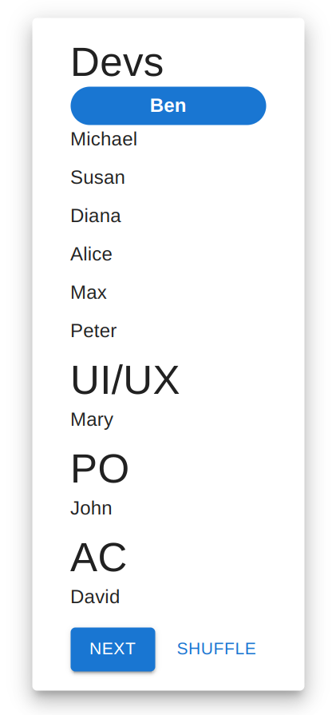

# Daily Driver

## Google Web Store Listing

* This extension can be found in [Google Web Store](https://chrome.google.com/webstore/detail/daily-driver/mhamhdaengbffbibjdlnlcfcghgcclnc)

## Setup

* Install [node](https://nodejs.org/en/)
* Install [git](https://git-scm.com/)
* Clone repository `git clone https://github.com/maxlmo/daily-driver`
* Run `npm install --global yarn` to install yarn
* Run `yarn` to install all dependencies
* Run `yarn start` to start web app
* Run `yarn build` to bundle web app

Happy coding :)

## Usage

Productivity tool for remote scrum teams.
This tool can be used on every website (e.g. jira/trello/github) to give your daily meetup a speaker order.
Simply set your attendees, shuffle and start your meeting without hiccups.

